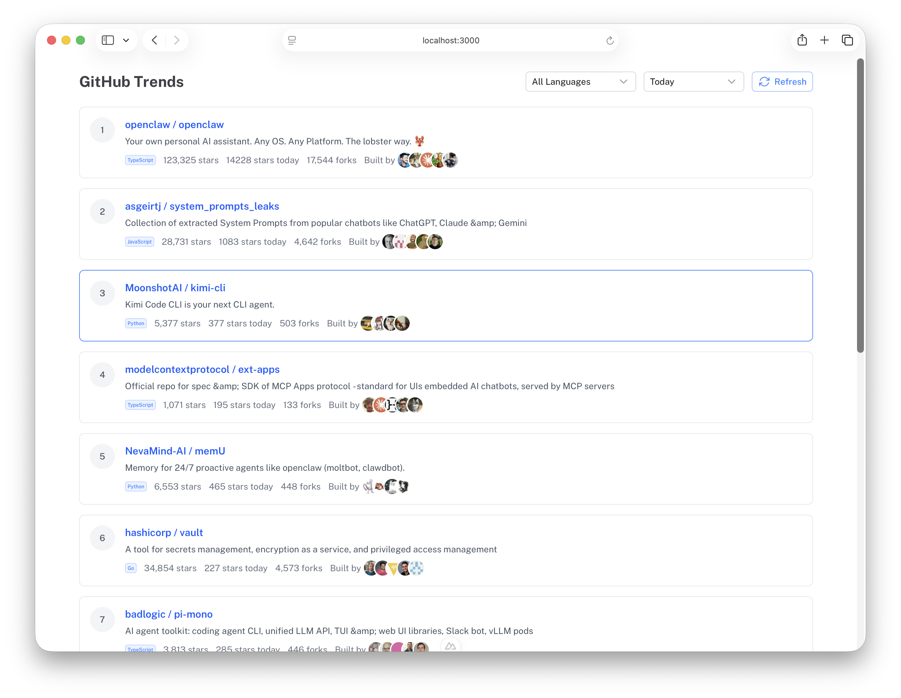
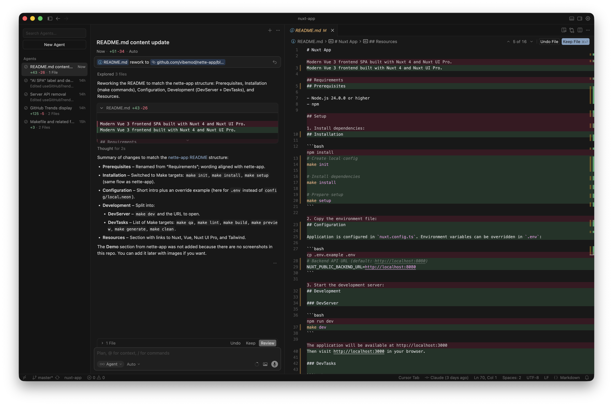

# Nuxt App

Modern Vue 3 frontend built with Nuxt 4 and Nuxt UI Pro.

## Prerequisites

- Node.js 24.0.0 or higher
- npm

## Installation

```bash
# Create local config
make init

# Install dependencies
make install

# Prepare setup
make setup
```

## Configuration

Application is configured in `nuxt.config.ts`. Environment variables can be overridden in `.env`:

```bash
# Backend API URL (default: http://localhost:8080)
NUXT_PUBLIC_BACKEND_URL=http://localhost:8080
```

## Development

### DevServer

```bash
make dev
```

Then visit http://localhost:3000 in your browser.

### DevTasks

```bash
# Quality assurance (lint)
make qa

# Run ESLint check
make lint

# Build for production
make build

# Preview production build
make preview

# Generate static site
make generate

# Clean cache and build artifacts
make clean
```

## Demo

### Nuxt



### Cursor




## Resources

- [Nuxt](https://nuxt.com)
- [Vue 3](https://vuejs.org)
- [Nuxt UI Pro](https://ui.nuxt.com/pro)
- [Tailwind CSS](https://tailwindcss.com)
